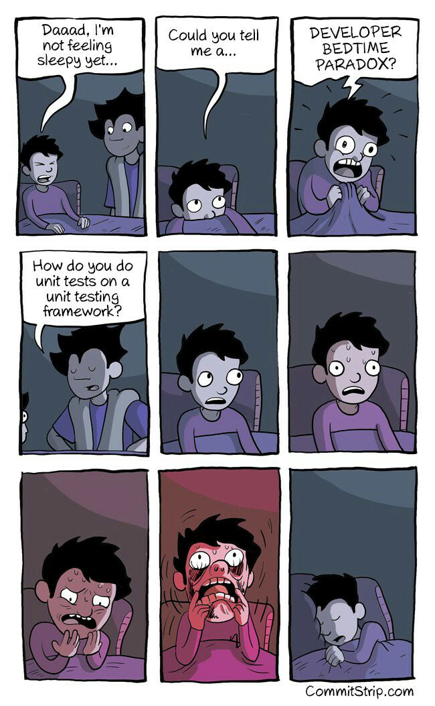

Hi,

this is a training repository for [Kottans web course](https://github.com/Kottans/web). You can try sending pull-requests to this repoistory proposing a change..
The change can be anytthing you like - for example, fixing a typo in README.md. Consider this phrase, for example:

*internationally misspilled phrase*

Try it! It’s fun, we promise :)

By the way, creating issues is fun too!

+

**NB! You pull-request may not be reviewed very quickly, please have patience.**

----------

Here you can see [How does the Internet work](https://www.youtube.com/watch?v=qEdv_pem-JM) or play some funny [game](http://spielzeugz.de/html5/liquid-particles/)

What's up?

Oops, someone pushed first. This line is already taken.

