[](https://github.com/kottans/frontend)
[](https://github.com/kottans/backend)
[](https://github.com/kottans/git-course)

Hi,

This is a training repository for Kottans [frontend](https://github.com/Kottans/frontend),
[frontend](https://github.com/Kottans/backend),
and [git](https://github.com/Kottans/git-course) courses. 
You can try sending pull-requests to this repository proposing a change.
The change can be anything you like, for example: fixing a typo in README.md. Consider this phrase, for example:

*This was an intentionaly mispelld phrase*

Tell other kottans a couple of words and add a fancy picture.

Try it! It’s fun, we promise :)

**Please, add your greetings at the end of file.**

By the way, creating issues is fun too!

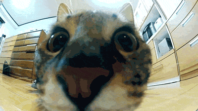

**NB!**
 - **Your pull-request may not be reviewed very quickly, please have patience.**
 - **If you need help with a PR (e.g. resolving merge conflict) ask the community for support**
   **posting a message `#help_wanted` + link to your pull request**
   **( e.g. https://github.com/kottans/mock-repo/pull/145 )**
   **in a chat of the course you're taking.**

If you are impatient use
[frontend course](https://t.me/joinchat/DmX0JBHVkEhV1us2HdMmpA),
[backend course](https://t.me/joinchat/Dqrdixe1c2K9bXUFBzNWtg)
or [git course](https://t.me/kottans_git) students chat
with other to get fun from a good conversation.

P.S. Where all postings before March 2018 have gone to?
[Here they are!](archive.2017-2018/README.md)
(git tag [`v.2017-2018`](https://github.com/kottans/mock-repo/tree/v.2017-2018))

---

Greet everyone on this incredible cource!!!

## Hi, everyone! I'm glad to be here)
[Me](https://github.com/Lu-sure)  :red_haired_woman:
And here is my ~~cat~~ dog Easy! 
 

Hello, kottans! :smile_cat:  
Come on to my [GitHub](https://github.com/dankor1498)

Hi and pryvit 😺😺😺.
## My name is Yevhen Tkachenko (https://github.com/t-jay-777)
# Dont worry and be happy!


# Hello =)
I am [Yaroslav](https://github.com/littleproger)
Have a nice day and be happy!)))

=======
# Hi Everybody!
My name is Marina, and my inspiration - Vanya The Cat :D. Glad to join the community!

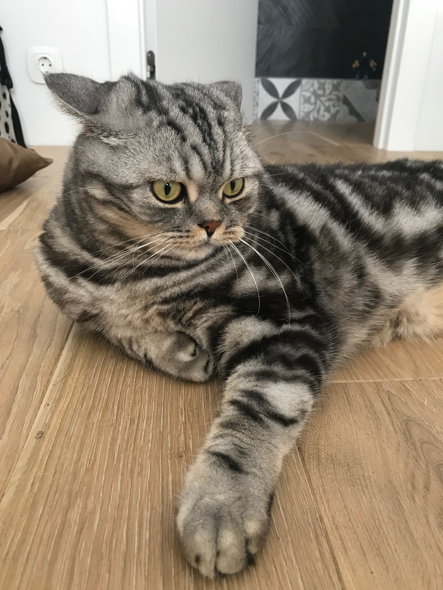

# Hi Everybody!
=======
# Hi

# Hello, everyone

## Hello :)


# Hi all, I'm Dima!

You can find me on [linkedin](https://www.linkedin.com/in/dm-poliuha/), or on [github](https://github.com/DmitryPoliuha)


 
# Hello, Kottans!
## I'm so happy to be here!
My name is [Natalia](https://github.com/natarrambide)


# Hello, Kottans!!!
My name is Heorhii. Yesterday I finished the Udacity Git Course and it was awesome!!!

# 😺
I’m very happy to hear that 😺

# Hi, everyone :)
I am [Daria](https://github.com/darialiakh)
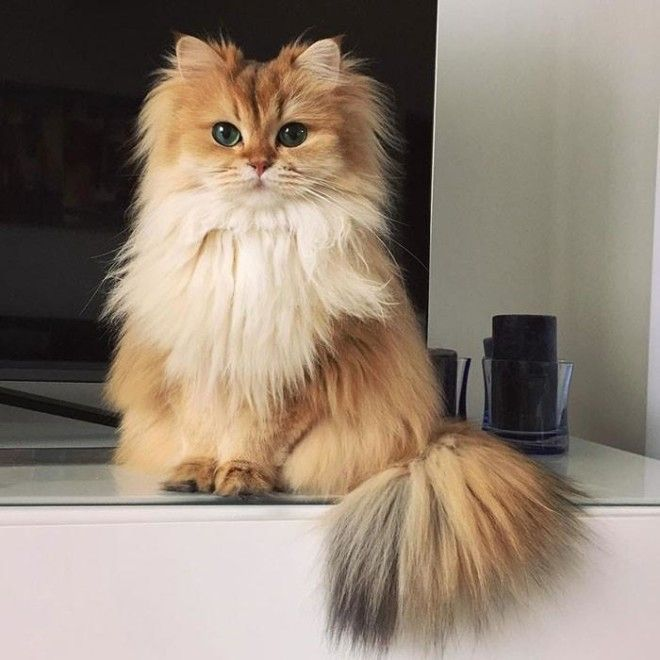

# Hello :)

My name is [Oleksii](https://github.com/oleksii-manzik) and my cat is Arnold

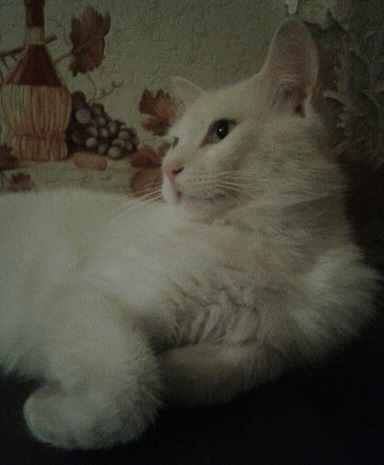

# Hi Everybody!

Great course! Wonna learn it with you.

# Hi!
## I'm glad to be here!
I am [Max](https://github.com/maodzin).

All stuff is new for me but very **useful**!

# Hi :)
Productive autumn for everyone!

# Hi!
My name is [Hlib](https://t.me/gzomgzon) and I glad to see you. I will study this course with you.

# Hi Everyone!
Have a nice days!

# Hi!
Congrats with 256 day of a year!
It`s a programmer day today 13.09.19!!

# HELLO BABES!
WANNA COMPLETE THIS COURSE!

## Hi everyone!


# HI KOTTANKIND!
I am Dainis ,dude what want to learn back end.


[](https://github.com/kottans/frontend)


Hi, kottans! Nice to meet you!

##### H E L L O!
:smirk_cat:


_________________________________________________

# Hi, kottans!

I am [Liu](https://github.com/Jam-Iko)
Here's a tipo for somebody to fix :)

_________________________________________________

# Hi, there! My name is [Oksana](https://github.com/katrukha).

My cat and me are looking forward to the next tasks

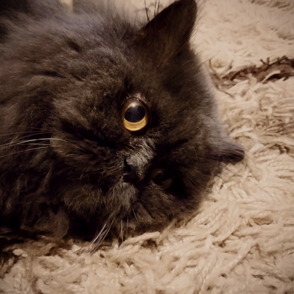
:smirk:

## Have a nice day!
_________________________________________________
# Hi kottans! My name is [Sergey](https://github.com/LenkovSergey).

## Hope it will be interesting

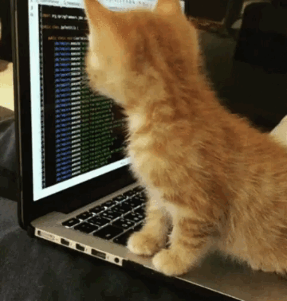
_________________________________________________
# Hello everyone! My name is [Serhii](https://github.com/serhii73).

## Nice to meet you all.


_________________________________________________

# Hi, everybody! My name is Dima.

# I want learn more about backend;

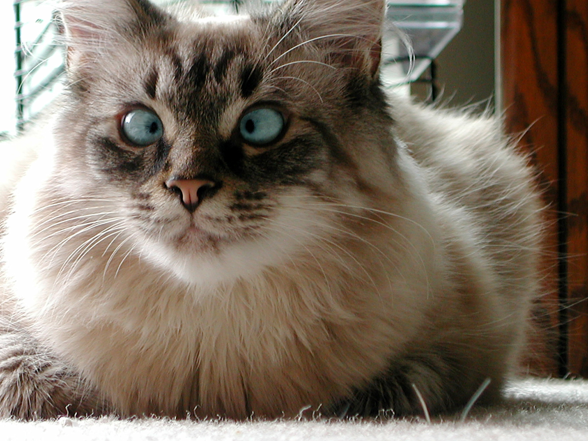
_________________________________________________

_________________________________________________
#### kottans-backend

#### HI, THERE! My name is Andrew
I'm glad to be here!  Best wishes to the Kottans community!
_________________________________________________
# Hi, people! I'm Viktor.

# following the rest I want to introduce my kitty Buba's
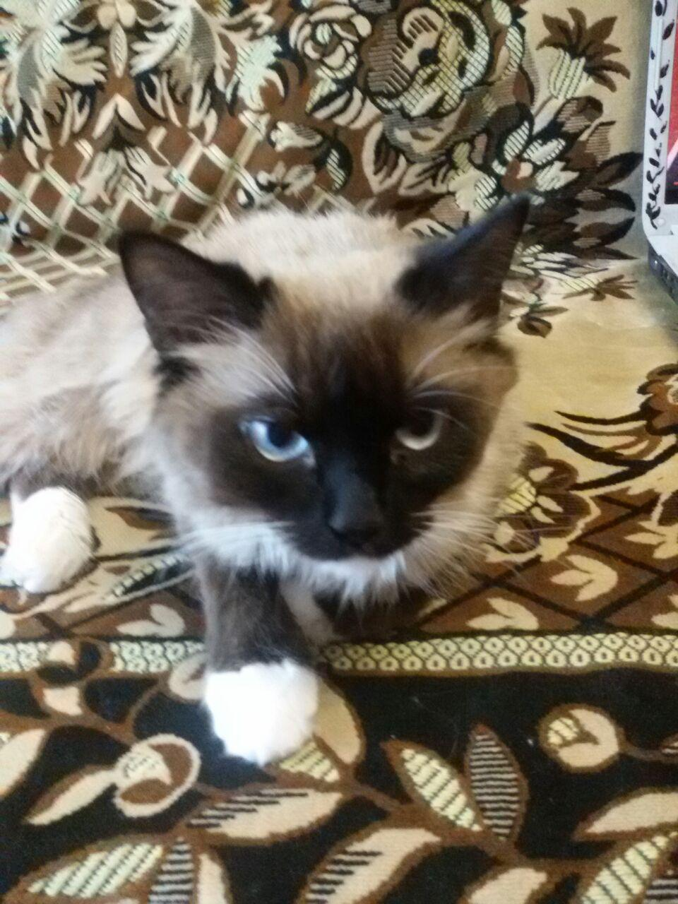
I hope for good cooperation. It is very pleasant to be in the company of like-minded people.
_________________________________________________
===============================
__________________________________________________________________________

# Hi, Kottans people!

My name is Julia and I want to greet all of you and to wish you productive work!

__________________________________________________________________________

# Hi, kottans! I'm Max and that's my cat - Juja.

We are happy to join you =^.^= !

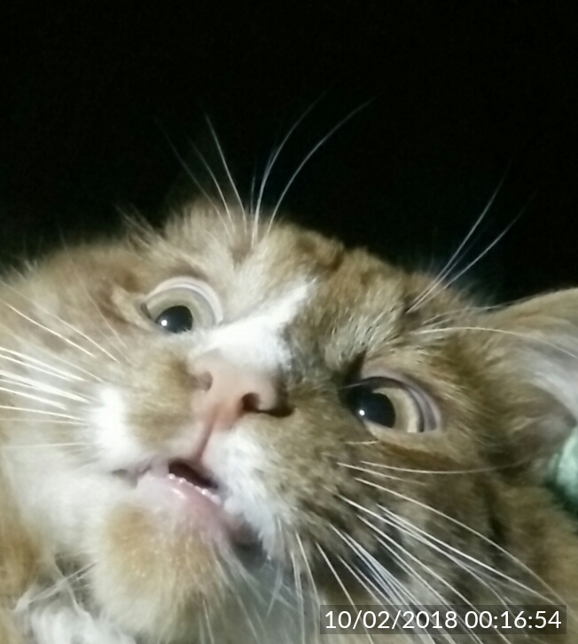

_______________________________
=======
______________
## Hey People. That's good to become a part of this team!
My name is Rustem and good luck to everyone!

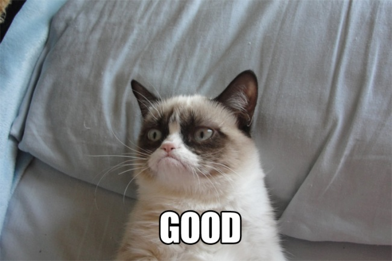

## Hey Frontenders!! Happy holidays and a happy new season of this course!!
My name is Mitya, soon we all will be really good in doing things right!

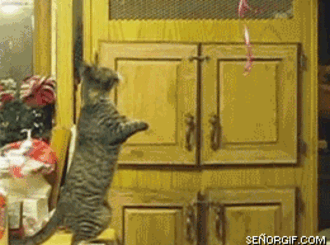

# Hello there, Kottans!


______________

# Kottans, I just want to say Hi!

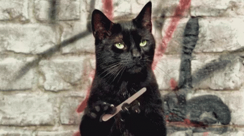

______________


Nice kitten, by the way

----------

Hello World! I'm Alexandr Nikandrov from Kiev.

*It was an intentionally misspelled phrase*


============================================
_________________________________________________

# Hello Kottans!


_________________________________________________

# Hello Kottans!
HOLIDAY GREETINGS!!!!


# kottans-frontend

## HI, THERE!

I'm glad to join kottans community!

Best wishes, Vitaliy  :)


__________________________________________________________________________
# Hi! I'm Vitaliy.

Kottans the best of the best!!!


__________________________________________________________________________
# Hi, kottans! I'm Dima from Kiev.

I am very glad to join you =^.^=

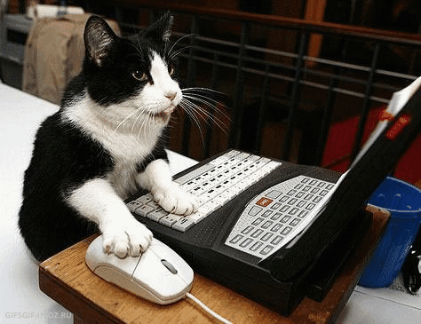

_______________________________

# Hey, kottans  =^.^= !

 I'm Olena and I'm glad to become a part of this incredible community!

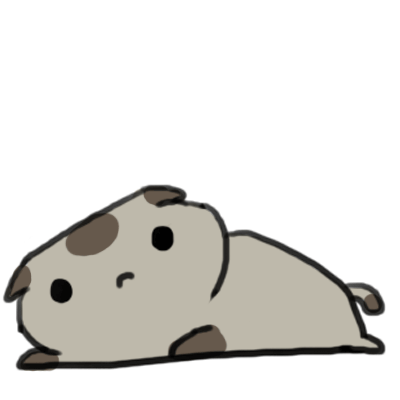

# <> May the Code be with us! </>

Hello Kottans! Aspiring to join your community

________________________________

============================================
********************************************

Hi, kottans!

I'm Olga, glad to meet you!

Ready to work hard and not to sleep at night

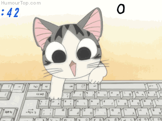

============================================
********************************************
============================================
********************************************
Hello, Kottans!
Glad to be here)
============================================

Hello, Kottans! How wonderful that I found you!
===============================================


{}{}{{}{}{}{}{{}{}{}{}{}{}{}{}{}{}{}{}{}{}{}

Hi everybody!!!!! I`m ready to study. I want to learn something new and fresh!!!!!
I want to be in your team!!!!!!


----------

Hi Kottans! Excited to join =^.^=
===============================================

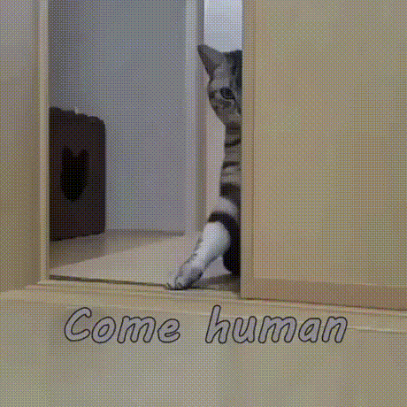

----------

Hi guys!!! I am beginner in programming world! This is my first pull-request.

----------

~~Meow~~ Hello, guys
I want it to be a cat. Go! 

----------

- Holla everybody! =^.^=

===============================================

***
Hello, everyone! Let the cats be with us!
***

Hi, kottans. Feels like should be here.


----------
Hi, Kottans! Just finished a Git and GitHub course at Udacity.
Thank you so much for this tip!
----------
## **Hi, dear Kottans! I'm so happy i'm not alone one my way to becoming a frontend ninja! Let's do it!** ❤️

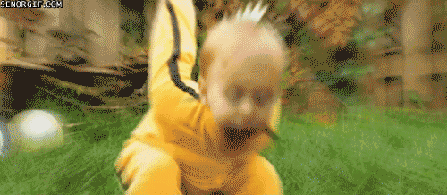
----------
h1, all!
```javascript
while(true) {
  learning();
}
```

Ooops! File changed. This line can be removed.
----------------------------------------------
##Hello! I'm Anton! I'm so happy to be in your team.
I think it should be here.
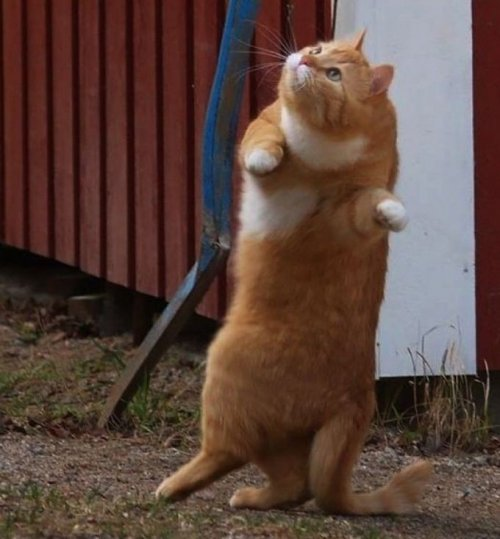


## **Hello, Kottans! Thank you a lot for the opportunity and knowledge, people who invest their time in this breathtaking community, be worth a great respect!**

****************
<Andrey, Odessa/>
****************

*first-time on the kottans pre-course:*

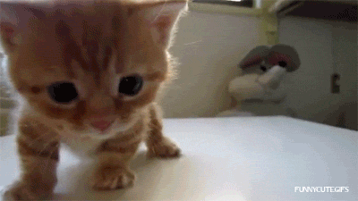

=======

## **Hello, guys! Want to start my path in Frontend.**


=======
### Hello,kottans! You're beautiful. Wish you best [coding](https://github.com/)

`## **Hello, hope to join the course, really excited**


...........................

Hey everyone! Happy to be a part of such a great team! You're awesome ^-^

### у меня есть кот, но он злой

-----
Hello kottans. I will hope that with the second attempt I will cope with this course))

--------------------

## Hi, everyone! I'm Olena. It's so exciting - join to your team. I hope complete stage 0 and have the opportunity to work with such cool community.

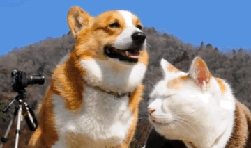

-----
My cat's name is Houston, it's not any fun, but it became when I adopted lady-cat whose name is Whitney.

hey there
----------
## Hi, my names Sergey. I'm from Mukachevo.
 I am pleased to participate in this course.

# Hi there. I'm Viktoria. And this is my cat - Tisha. We really hope will become part of kottans family.

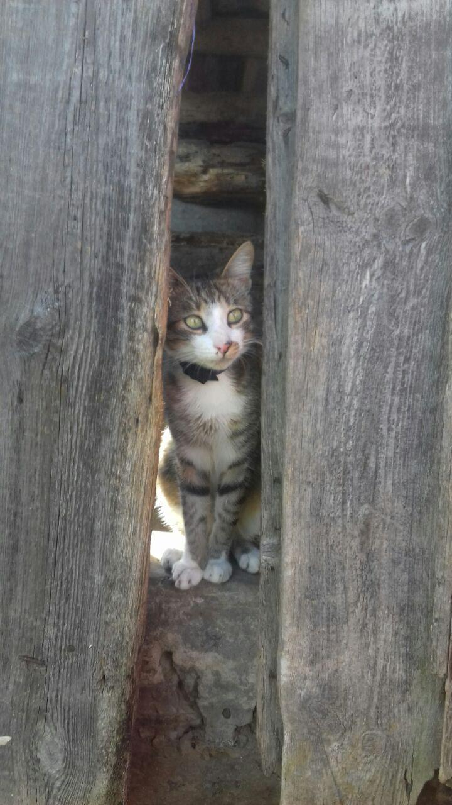

## Privetiki, kottans!
I'm Maks and it's a pleasure for me to join this community. Good luck for everyone and have a nice day!


## How it is look like, when you dive into first Udacity course about Git and try to understand all this new information, furthermore, given in english..


-----------------------------------------------------------------
## Hello, Kottans!

Like Dota-2 players says "Good luck, have fun!"
-----------------------------------------------------------------

-----

## Privetiki, kottans!
I'm Maks and it's a pleasure for me to join this community. Good luck for everyone and have a nice day!


 Hello, everyone! I'm Artem from Kiev.
 This is my first pull-request. That's fun.

## Hello there, community!
I'm Denis and... Ow, all these gifs! Just get one more :)


---------------------------------------
##Hey, kottans)
My name is Vanya, and I am glad to be part of the team.
(I feel myself now like - )


----------------------------------------------------------------
## Hi everyone :)

------------------------------------------
## Hi, guys

-----------------------------------------------------------------
## HI, Dudes!
I'm new in your community,you all are cool^^
### Together - we are force!!!!

-----------------------------------------------------------------
### In force we trust!
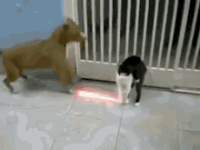

-----------------------------------------------------------------

## Hello everybody!


## Hi, Kottans!
Happy to become a part of this great community!
### Let's the training begin!!! ;)
-----------------------------------------------------------------

## Hi everybody ;)
My name is Ivan.
-----------------------------------------------------------------


-----------------------------------------------------------------
=======
## Hi, there!
I really loved to learn about Git and GitHub from Udacity course and I will recommend it to others! To my consideration, Kottans made a great job on sharing the valuable knowledge with others) Hope to try the whole frontend-course!
Best wishes,
Natalie Reshetnikova


-----------------------------------------------------------------

## Hi! I'm cat sheriff

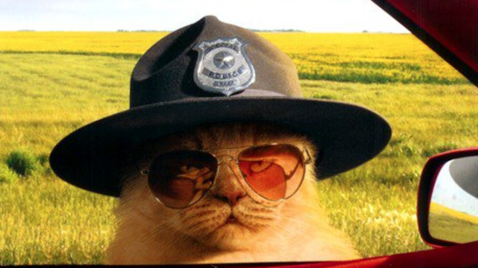

-----------------------------------------------------------------
## Hi guys,
My name is Vania and I'd like to join your team :)
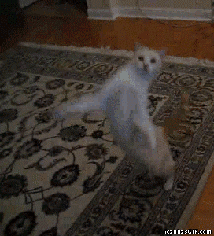
-----------------------------------------------------------------


## Hi Everyone!
Let the party start!
Igor K


## Hello, kottans ^_^
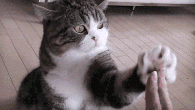


-----------------------------------------------------------------

## Hello everybody, I'm really satisfied to be here. Separately thank =^.^= for that opportunity!!!
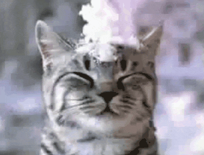

-----------------------------------------------------------------

-----------------------------------------------------------------

## Hello there, kottans :hugging_face:
I'm Michail and I'm freaking curious about the outcome of your project for myself.
Have fun and be :cat:


-----------------------------------------------------------------

Hello. My name is Vlad. I'm very excited too. If you don't see it just believe me. Really.

## Hello Kottans!
I'm excited that I opened this community. I would like to be part of that amazing team)


-----------------------------------------------------------------

## Hi there!
I'm Nataly, nice to join you!
Let's get prepared!


-----------------------------------------------------------------

## Hello, Kottans!
I'm really into your course and community.

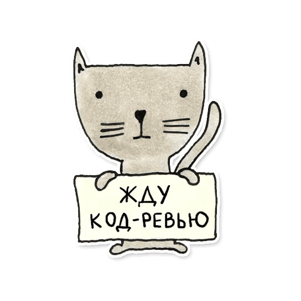

-----------------------------------------------------------------
# Hello to all KOTTANS


**I'm Ed and I'm ready to study!**

-----------------------------------------------------------------

## Hellooo
I'm Ruslan. I came from Siberia, but now I live in Kiev. After exploring the Kottans community. All success and good mood!

[Hello](https://media.giphy.com/media/bcKmIWkUMCjVm/giphy.gif)

----------------------------------------------------------------
## Hi, everyone
It was very hard and informative PR)

--------------------------------------------------------------------

## Hello, Kottans!
I'm glad to be a part of this community!


### Hi to all Kottans ^..^
happy to be a part of your community


 --------------------------------------------------------------------

## Hello Kottans. Glad to invite this community

----------------------------------------------------------------

## Hi, Kottans!

The Friday hacker cat breaks into the Kottans company again! Let's be friends! :)

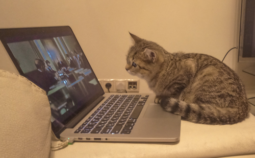

----------------------------------------------------------------

## Hi! Let's do it!

Don't stop, go, go, go! :)

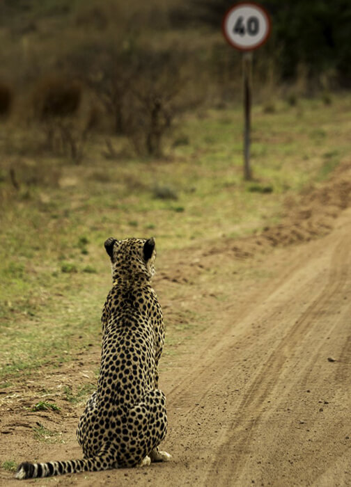


***********
Hi, Kottans !

----------------------------------------------------------------

## Hello, Cuties!

Make frontend great!


----------------------------------------------------------------

## Hi! Kottans!

I'm Nick, nice to join you!

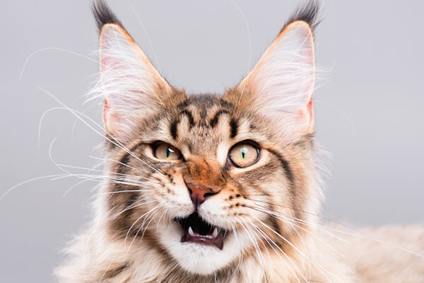

---------------------------------------------------------------

## Hola!

Have fun!

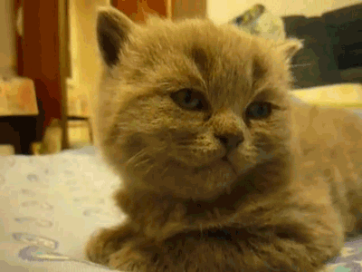

---------------------------------------------------------------
## Hello Kottans

I'm glad to join!


## Hi to all

I'm Maryna, and I'm glad to join your Kottans community.

---------------------------------------------------------------
## Aloha

I'm Anton from Kiev, nice to be part of Kottans community.


## Hello friends

I'm Igor, and I'm willing to learn
---------------------------------------------------------------
## Hi! Kottans!

I'm Anton, nice to join you!
---------------------------------------------------------------
## kottans-frontendо from Mandzia Bohdan, Kyiv

GitHub очень ценная штука, сохранение новых версий, внесение изменений, решение конфликтов реализовано очень чётко. Надеюсь использование данного ресурса в дальнейшем не вызовет у меня трудностей.<br>
Данная отметка от Богдана г.Киев<br>

---------------------------------------------------------------
## Hello community :D
I wish everyone to have fun and keep in mind: "Fail is integral part of success. Keep working".


---------------------------------------------------------------
## Hi guys!! Cool to join you community!!


---------------------------------------------------------------

Hi guys, it's nice to join you.
Happy coding!


---------------------------------------------------------------
## Hello, kottans
 


## Hello!

I am Vlad from Kyiv, and I'm excited to enroll in this frontend course :D

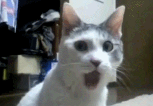

## Hi everyone!

[I'm](https://github.com/DJStar77) glade to join Kottans Team!
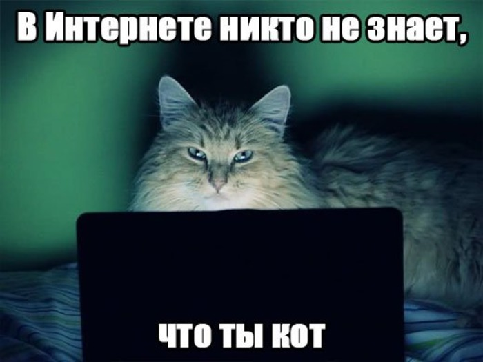

---------------------------------------------------------------

## Hello everyone :)

I'm Tania. Nice to join you!

=======
## Hello!

I am Leonid. I would like to working on this course remotely.
I hope you will make the following tasks and some lectures available online.

## Hi, friends!

I`m Alex from Kiev!


--------------------------------------------------------------------

## Hi team
[I'm](https://github.com/V1taliy) Vitaliy from Kiev and I want to join Kottans Team!
##


## Hi all!
I'm Viktor from Zhytomyr! I'm real ninja :point_down::point_down::point_down:!


## Hello there!
I'm Max I'm from Kyiv


------------------------------
#Hi, kottans!


------------------------------
# Hola, kottans!
I'm Sergey from Kiev. Very glad to join


------------------------------
#Hi, all!


## Hello!!

I'm Vitalii.


## Hello, everyone!

Good luck in learning!


## Hi kottans family!
I'm Svitlana from Vasylkiv
Hope we have a good start here ^^


## Hi, this is Denys from Kyiv
This is gonna be fun!

## Hello, kottans! I'm Sasha from Kiev.
I hope for fruitful work with you:cat:
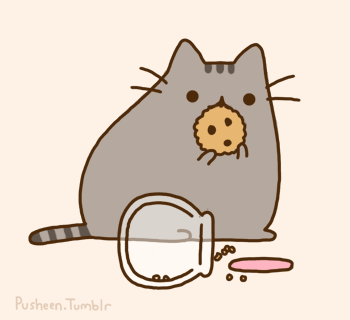

# Hi Kottans!
My name is Kharchenko Andrew.
I want to learn more about FE!


# Hello Kottans!
Thank you for your community!
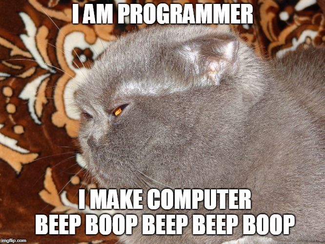


# Hello, everyone!
<br>
<b>Are you ready for a new experience?</b>


<br>

# Hi, Kottans-Frontend Club!
<br>
Nice to meet you! I'm Peter. Thank you for opportunity to learn this course and to communicate with others.
I have interested Udacity git course especially for building excelent concept map of Git.
I have enjoyed course *try.githab.io* for studying materials, such as *learning git
branching* with graphical view of git commits as a tree, *github learning lab* with interactive activities.
<br>

# Hi Kottans!
I'm Sviat from Kyiv. I like sphinxes.


# Hi guys!
Would be great to join you!

## Hello everybody!
I'm Artem from Kyiv, Ukraine.
<i>Nice to meet all of you! And thanks for good opportunity to kwon something new.</i>


Hello, everyone!
Thank you for such great courses!!)

## Hello there!
I'm Vladyslav. I'm from Kyiv


## Hi!
My name is Yulia. Nice to meet you, guys!
<br />


# Hi there!
My name is Evgen.
Nice to join you.


## Hello!
I'm Evgeny. I'm from Kyiv
<br />


## Hi!
I hope I can get to the outgoing train.
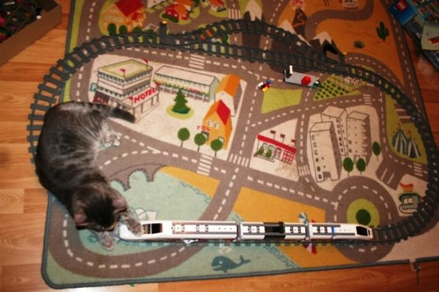

## Hey!
Oh, those cats..


_______________________________


# Hello, kottans! I'm glad to see you all here ))).

It's great that I can be part of your community.

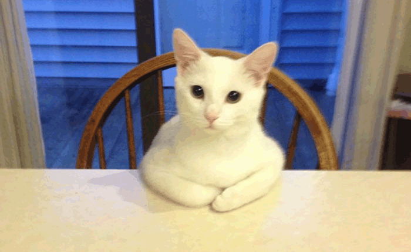

_______________________________

## Hi guys!
I'm in disguise.


_______________________________________________

## Hi, kottans!
I'm late, but I hope, I'll can study with you!


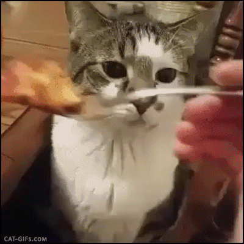

_______________________________

## Hi, my names Sergey. I'm from Kiev.
 I am pleased to participate in this course.


_______________________________

## Hello there
 I'm Georgiy and I came here to study.

 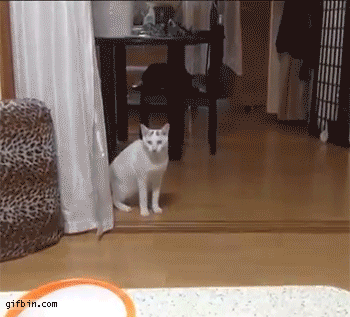
 _______________________________

## Hi, I am madmax.
I started to learn kottans course.

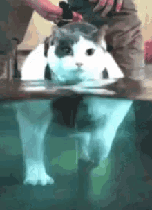
  _________________________________
 ## Hi, everyone!
My name is Serhii.

Happy to discover your community.

Thanks for p2p.


_________________________________

## Greetings!

I'm Peter and ready to join the guild "p2p" :)

Good luck everyone.

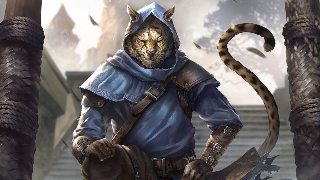

## Hello everybody!

I'm Mirlan and very happy to be here with all of you!

# Hello everybody!
Nice to meet you :)


## Hello, Kottans!

I'm Nick and I'm ready to start this wonderful journey


## Hi, guys!

I am very glad to join p2p course!
It is really cool to learn front-end this way.
Thank you for this opportunity!

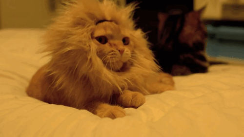

## Hi there! Glad to join you!
I'm Sergey from Kharkov and here is my cat --->

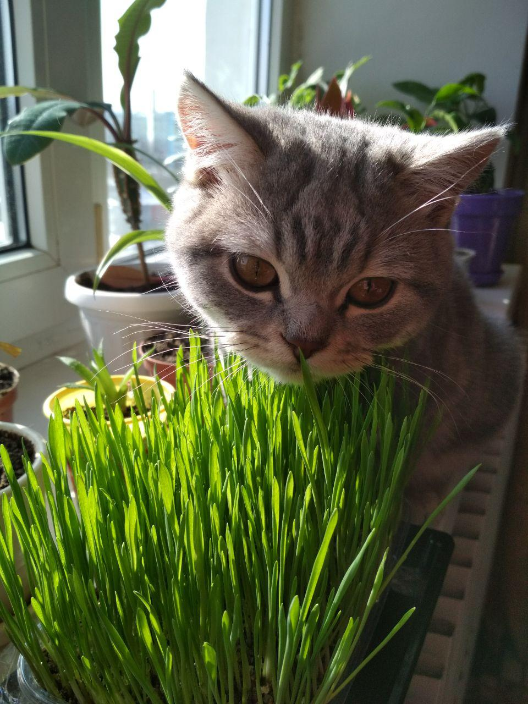


# Impossible cats are here!

Neural networks are the future of image processing in web technologies. An image bellow shows the cat which does not exist! Each time when you reload the page a new image is generated!

You don't believe? Refresh the page and see it yourself!!


## Hi my lovely Kottans! Let me join you!
I'm [Aymkin](http://naumk.in/) from Odessa, meet this funny pic another time


## Greetings, Kottans!
Let's start the journey!


## Hello, Kottans!
Let's see how it works!


##Hello, awesome comunity!!
I just started p2p - course and it is gonna be awesome)


## Hi, everyone!
I'm Yuliia and I'll be okay with it =).

## Hi there!


## Hello, everybody!
Thank you for p2p! :-) I wish everybody don't give up and go to their goals!


# Hi there.
I'm Irina. I hope to be part of the Kottans family.
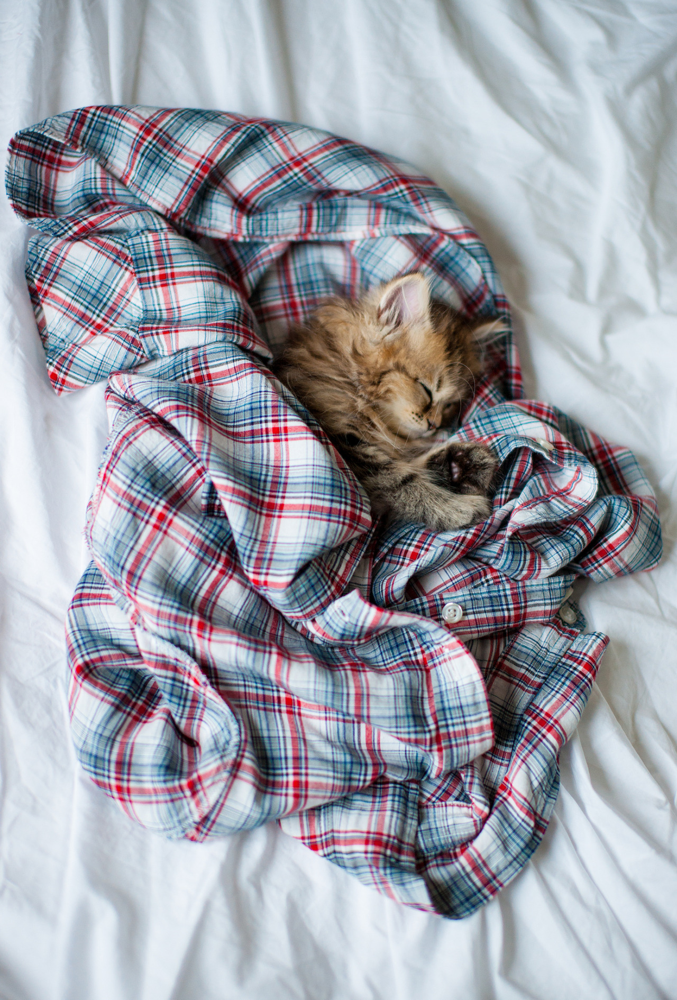

# Hi, kottans!
I'm doggan :) and my name is Jack Loki. Nice to meet you!
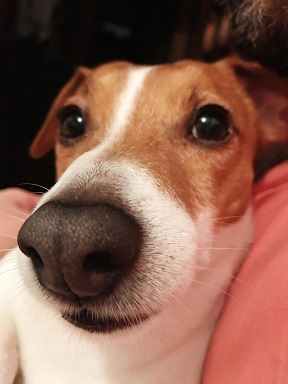


# Hello, kottans!
I'm Viktoriia, I will study frontend with Kottans!

# Hello Kottans!

My name is Roman!
Thank you for an excellent batch of recources.


## Hi Kottans!

I'm Nevty.
Glad to be part of this community.


## Hi Kottans!

My name is Vasyl. Nice too meet you guys :)


## Hey there!

I along with my cat Maya (that's a photo of random cat from the Internet below, not Maya's :smiley_cat:) am going to join this awesome community. I hope it's gonna be a fun ride!:wink:


## Hi!
Three wise men of Gotham,
They went to sea in a bowl,
And if the bowl had been stronger
My song would have been longer.

# Hi, everyone! My name is Stas
I'm glad to join the course


## Hi,
i'm _laverka_, and going to join to backend course.
In case anyone is from **Lviv**, let's keep in touch
***
<pre>
   /\     /\
  {  `---'  }
  {  O   O  }
  ~~>  V  <~~
   \  \|/  /
    `-----'__
    /     \  `^\_
   {       }\ |\_\_   W
   |  \_/  |/ /  \_\_( )
    \__/  /(_E     \__/
      (  /
       MM
 </pre>
_______________________________________
## Hi, my name is Mike. thank you all!
***

## Hi Kottans! I`m **Dmitrii**

I'm new in your community and want to study back-end)

## Hi! My name is Misha.
I am from Kyiv. And this is my "kotan")


---
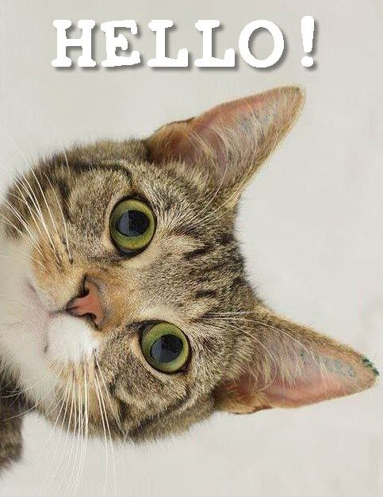

---


## Hello, guys! Let's became masters of back-end!)
Artem, Kyiv.


## Hello, everyone! My name is Vitalii and I'm keen on learning Python. I'm waiting for interesting community and rapid development


### Hi everybody
My name is Dmitro. I'm extremly excited to join this course.
And hello from my cat Ruby (like on rails, yes)

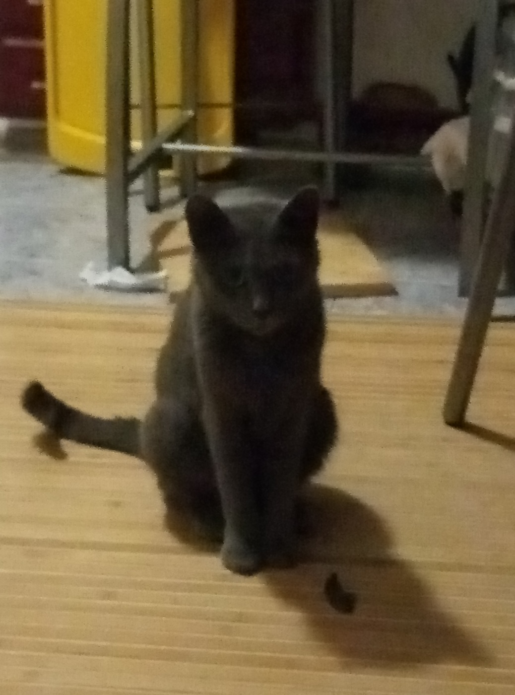

## Miou, kotany

**Hi everyone, my name is Denis.**

I ~~hope~~ know that this course will be useful for me :)

![Cat][gif/art-kot-koster-shlem-skyrim.jpg]

## Hi guys!
My name is Anastasiia. It would be great to join you :)
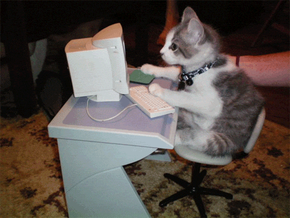

## Hi, I'm Vitalii. Let's go!


## Hey Kottans!
My name is Iryna. I would like to participate in the Backend Course.
Thank you for the great opportunity to learn more)


## Hey I'm Antony. I hope we'll have nice time together.


## Hello! I'm Sam...

## Let's get ready to rumble!
Roman


## Hey,fellows


## Hello everyone!
My name is Artem. I am excited to start the back-end course.


**Hi everyone, my name is Denis.**

I ~~hope~~ know that this course will be useful for me :)

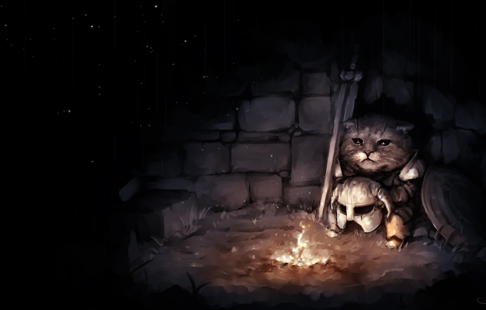

# Hello Kottans! I am Anastasiia.

###  I am pleased  to join your community. Happy coding!


# Hi, buddies!
Let`s get started 


# Hi Kottans! I'm [Dima](https://github.com/De-m-i-a-n)!
Many thanks to Kottans team for such a beautiful opportunity to get a good knowledge in easy and pleasant way for free!
Will try my best to become a good back-end developer!
I have some previous exp in JS, python and sql connectors, sql, html/CSS so I could contribute a bit if You need to) Just ask!)


# Hello! My name is Igor.

I have some experience with HTML and CSS, JS / React, Python / Django / Flask. I implemented a few small projects for my friends. I hope that Kottans' back-end course allow me to systematize and increase my level of expertise.


# hello
I am excited to learn basics of Git and Github. The information now is structured and clear. I would like to deep in this topic and make more practical tasks.

# Hello!

My name is Serhii. Nice to meet you all :)


My Hello to Kottans! )
=======
# Hello

My name is Alex, I got the job-offer for JS developer, that is why I need to find out what is Node.js. Previously I was a front-end Kottans's course student

---
Hi!
===
I'm [Viacheslav](https://github.com/ViacheslavIT) and I'm very exciting to join
to this very interesting backend cours.

I finished [**first task**](https://github.com/kottans/backend/blob/master/tasks/git-intro.md)
and I want to share my impression about this before start
[**next one**](https://github.com/kottans/backend/blob/master/tasks/unix-shell.md)

I got a lot of new information about basics things for Git and I will use these
knowledges next times in my work.

I hope, I will finish all tasks in time )))

Best regards!

**P.S.** Sorry, but I haven't any cats)))

---
# Hello overyone!

I'm [Alex](https://github.com/osiryi/kottans-backend)
Very excited to be on this course

Cheers!

---
# Hola fellow kottans students!

My name is [Eugene](https://github.com/sherlaimov/kottans-backend).  
I'm looking forward to uppping my game in the backend world, studying alongside the brilliant minds of the Kottans community.

Wishing everyone a fantastic journey here ;) 


# Hello there

Hi, my name is Sasha. I am 21 years old.

I  have finished the git basic course

Have a nice day:)


# Hi :)
My name is Juli
I am excited to be here.

------------------------------
# Aloha and mahalo Kottans!

I'm [Alexandr ](https://github.com/rekusha)
best regards

## Hello, kottans ^^
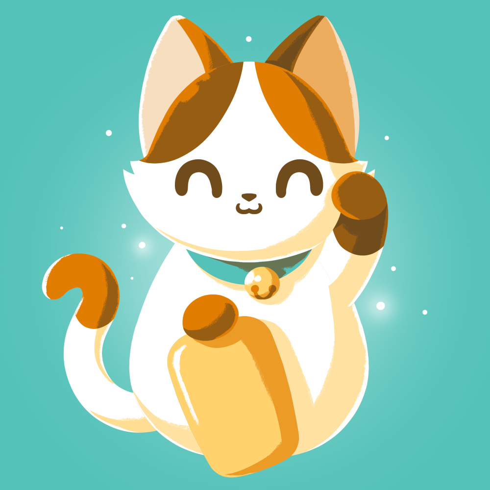

# Hi, nice to join you guys!
I'm Vitaliy. https://github.com/vik1803

# Hi.
I'm Viacheslav. https://github.com/dviacheslav


Hello! 

Im Vlad https://github.com/Wizardiq

Im happy to begin my path with you
---

# Hello Kottans!

=======
# Hello Kottans!

# Hi))
I'm [Vitaliy](https://github.com/vitaliy-ol).
This is my dog Cherry and she loves cats)
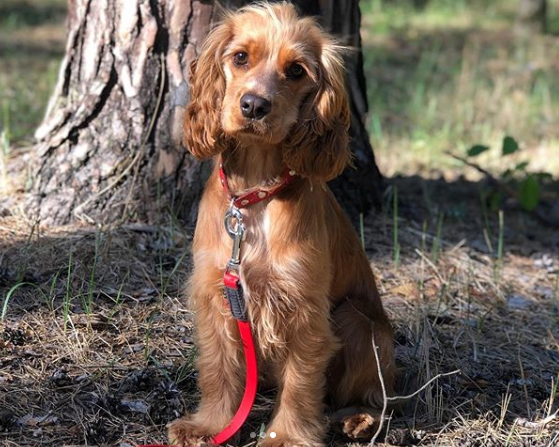

# Hi, my name is Alex (Oleksii)! 
Glad to be a part of the team, hope to get into the offline part of the course!

# Hello!
My name is Alex Bondar and i finally learned git. It's a fun and interesting. Try to learn it for yourself!
And you can find me here - https://github.com/ABondar-Neph

Hi, Kottans!
============
I'm [Serhii](https://github.com/serphiy). Nice to join you!

=======
#Hello Kottans! 
My name is Evgen. I am from Kremenchug.
This is my coder cat Plushka.
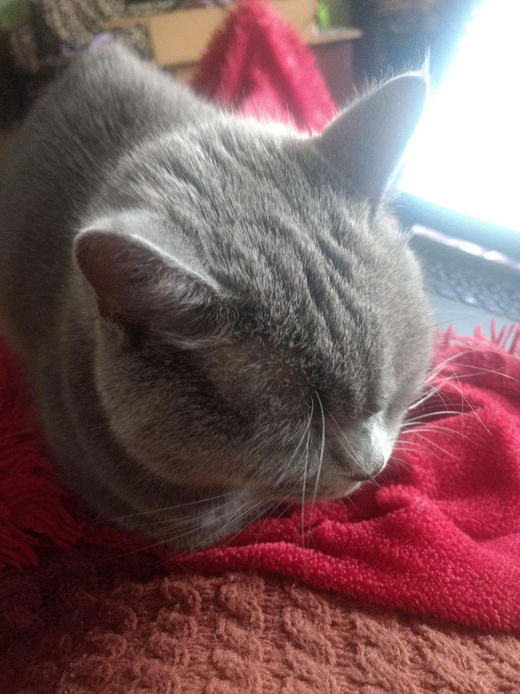


Hi everybody!
============
I'm [Igor](http://netcode.pro) and will be glad to join your community!

## Hello, Kottans!
I am  [Max](https://github.com/ms76adf1). Nice to meet you, guys!
<br />
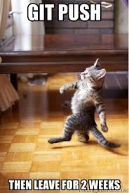

## Hello, Kottans!
My name is Yaroslava. Nice to meet you)
===
# Nice to meet you!
<details>
  <summary>My name is...</summary>
  
  ### [Sergio!](https://github.com/ITKozak)

  All in all a great course!
  I can also add an additional resource for practice blind typing - [TypingStudy.com](https://www.typingstudy.com/)

</details>

# Hi, guys!

---
# Hello

The task was to propose a change and I even thought about correcting some grammar mistakes, but who dares to change such a memory wall. So I will just leave my message as everyone: good luck and a lot of persistence everyone!

# Hello, Kottans!!!!! My name is Illia :) Nice to meet you!

 _._     _,-'""`-._
(,-.`._,'(       |\`-/|
    `-.-' \ )-`( , o o)
          `-    \`_`"'-

# Hi Kottans!

My name is [Hanna!](https://github.com/annyrandie) Nice to study with you:)

# Hello there!

My name is [Andrew](https://github.com/Shining-Diamond) it's nice to meet you
