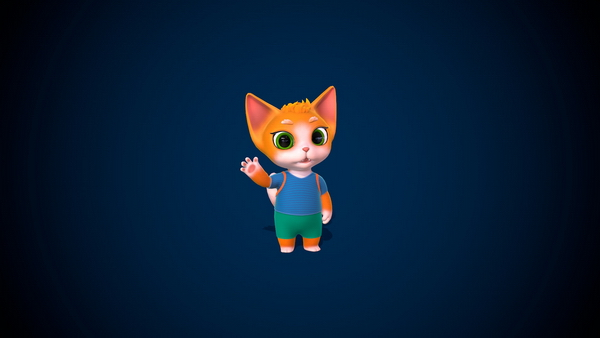
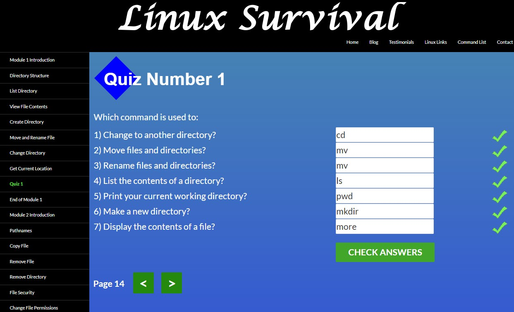
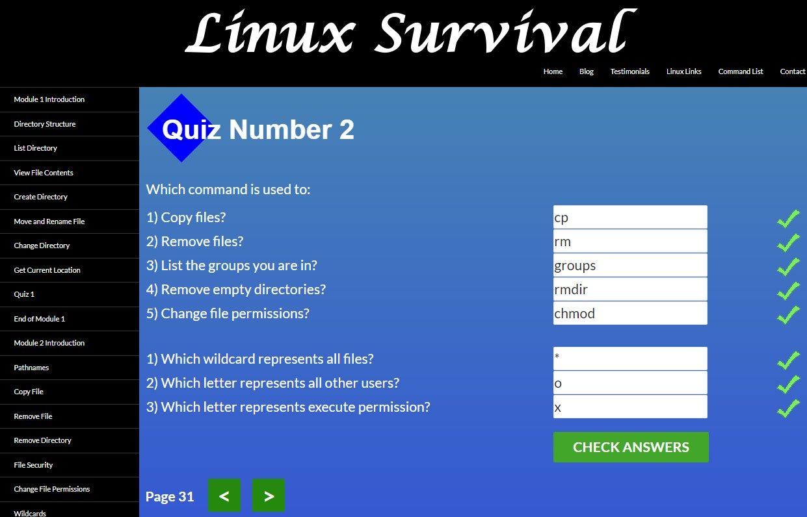
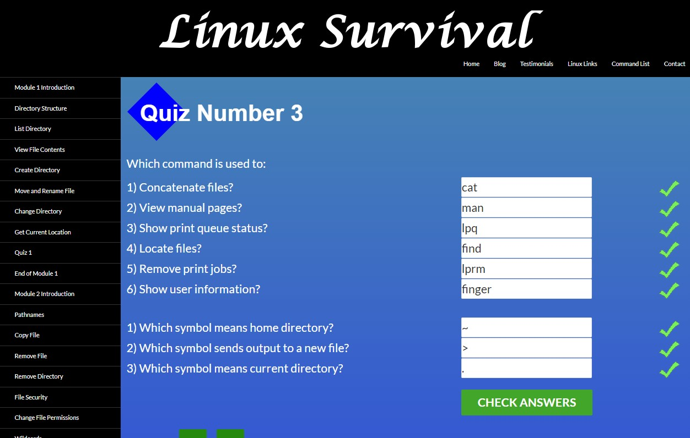
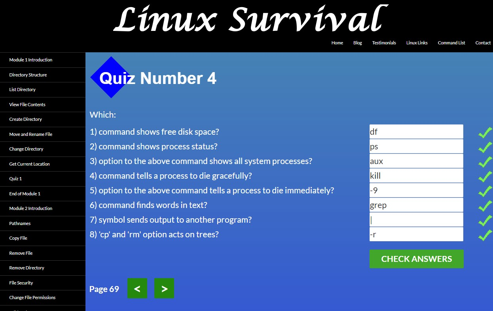


## Hello Kottans community!
My name is [Anna](https://github.com/nensi-n).
So cool to be here!

## Linux CLI, and HTTP

It's a great experience to see the difference between building a filesystem on Windows and Linux.
[Linux Survival (4 modules)](https://linuxsurvival.com/linux-tutorial-introduction/) 
interesting to pass all the levels, do exciting tasks))
