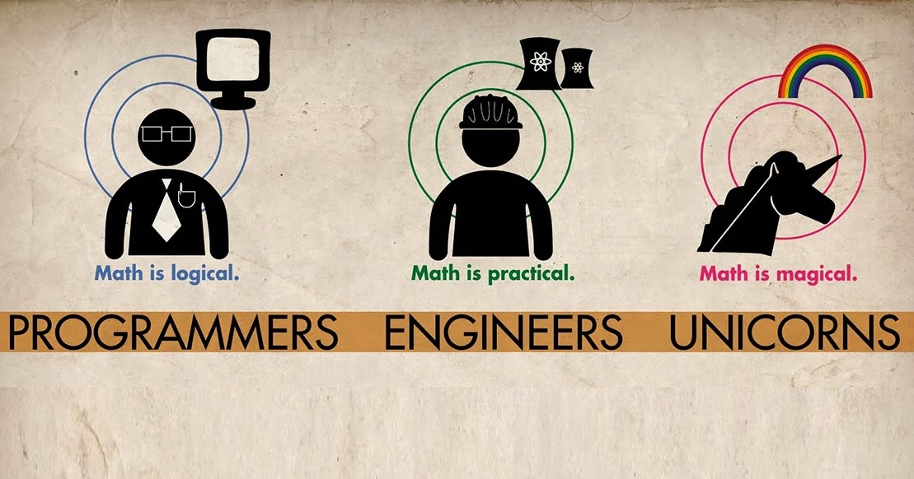
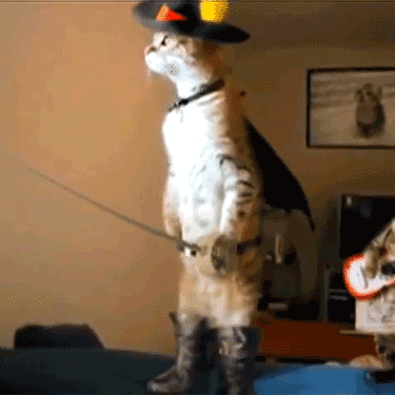
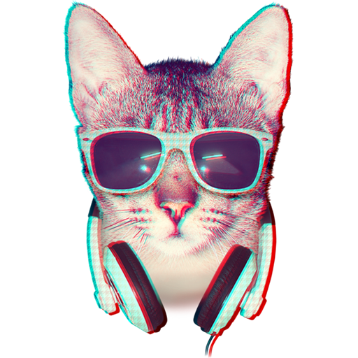

Hi,

This is a training repository for both [Kottans web course](https://github.com/Kottans/web) and [Kottans frontend course](https://github.com/Kottans/frontend). You can try sending pull-requests to this repository proposing a change.
The change can be anything you like, for example: fixing a typo in README.md. Consider this phrase, for example:

*This was an intentionally misspelled phrase*

Try it! It’s fun, we promise :)

By the way, creating issues is fun too!

+

**NB! Your pull-request may not be reviewed very quickly, please have patience.**

If you are impatient use
[web course chat](https://gitter.im/Kottans/web?utm_source=badge&utm_medium=badge&utm_campaign=pr-badge&utm_content=badge)
or [frontend course chat](https://gitter.im/Kottans/frontend)
with other to make fun from conversation.

----------

Here you can see [How does the Internet work](https://www.youtube.com/watch?v=qEdv_pem-JM) or play some funny [game](http://spielzeugz.de/html5/liquid-particles/)

What's up?

 some text added

Hi!

Hi)

Kottans unite! We must seize the world of frontend)

Hello)
Resolve conflict

Hey. How do you like this cat?

Hi there!

Hello everybody!)

Hi guys =)

<b>Hello all.</b>

Hello, World and Kottans!
- [x] Hello!

__Hi there.__ Hm, didn't know about *markdown* in README.md

Hello everyone!

How do you do, fellow kottans?

(Did I screw up the ascii logo already?)

      /\_/\
    =(/\./\)=
     (")_(")

----------

Hi everybody! I'm Anna. Pleased to meet all of you!

Here is my checklist for now:

- [x] Task_0

Here is your checklist for today:

- [x] Merge Anna's pull request with changes for the README.md file

:sweat_smile:
----------
Hello, guys! ˆˆ

-----------------------------
┏(-_-)┛┗(-_- )┓┗(-_-)┛┏(-_-)┓
_________________________________
Hi everybody!
My second try
:-)
-------------------------------------------------
Hi there. Really happy to be a part of this.

-------------------------------------------------

----------
*Hi there! I'm glad to visit this page.*

*Good luck to all.*

----------

-------------------------------------------------
HI!! =^..^=

Puss in the boots :)

HOW ARE YOU GENTLEMEN !!

This cat is ready for start, so be like him.

HELLO FRONT-END WORLD!!!
HELLO KOTTANS!!!

Meow! I'm with you, cats

-------------------------------------------------
Hi. This just for completing task 0, so never mind.
-------------------------------------------------
Hello everybody! I'm glad to join the learning!
------------------------------------------

 HELLO KOTTANS!!
 Its my pull-request
 We need more dogs
 

It's a fiasco, bro!

HI THERE)) Good luck to all and let's have some fun!

Hi everyone!

One more cat here.

hi there !

**Hello fellas and girls**

<h3>Hi guys! I'm Olga!</h3>

This is my first pull-request. Good luck to all of you! Hope I will  catch you up with all these tasks. This is me when I read Kottans/frontend chat at gitter

Hello everyone, I'm Helen.

Hello everyone. My lazy commit for being part of this great community.

**Hi all! Too many cats in one readme!))) let add one more!)**

Hi guys!
Be careful it's the karate-cat!
 

 

 Hi, there's double:)

 

Hey, people! Let's dance =)
 

 

 Hi :alien:s! You are awesome! Here one more )

 Hello to fellow kottans. Ready to depart!

 

 

 Hi everyone :wave: !
 :smiley_cat: Tried to find the best cat's gif but just spend few hours on 9gag :sweat_smile:

 

 **Hello everybody!)** :smiley_cat:
 I'm glad to be part of such a great community! :smiley:

 

 Hi! It's nice to meet you!
 __________________________________________
 Hi everybody from the Down Under! (^_-)Y

 

 **** Hi! **** 
 I'm Ira. It's very cool to be here! You're awesome!

 

 
 Hi everyone!
 
 I am glad I am joining the cource.
 
 
 
 

 
 
