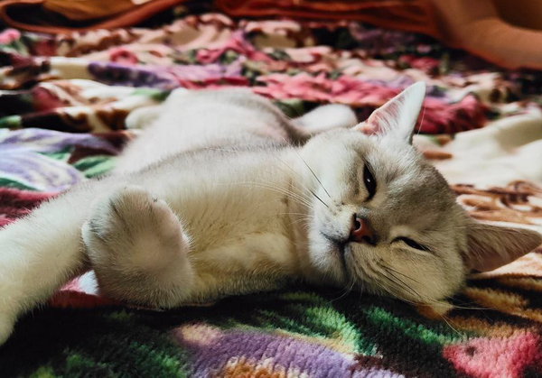
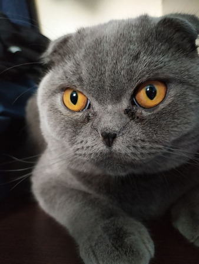

Hi! It's Ihor and I learn GitHub, at least i am tryy
I'm happy to be with kottans
https://github.com/kottans/mock-repo/blob/master/assets/images/ninja.jpg

Hi!!!
My name is Vyacheslav.
I glad to see you.
I'm glad to join the kottans community.

# Hello Kottans!

## Hi, kottans!!!

# Hi for everyone!!! I am Oleksandr!

I honor to be on this course.
Good luck for everybody)))

## Hello kottans!

My name is Vitaliy. I'm switcher )) I hope we'll have fun while learning. Good luck!  
Link to my repo [](https://github.com/MosQuitO404/kottans-frontend)  


# Добрий вечір, everybody :)

In spite of everything, lets enjoy this course!
Glory to AFU!

# Hello Kottans!

**_My name is Natalia_**

Fortunatelly I discovered **_Kottans_** on dou.ua, and now I'm here with you whether you like it or not :-P

By no means look on my repo. [Here it is](https://github.com/natalia-artsiukh/kottans-frontend.git), by the way.

---

# Hello kottans =(^.^)=, my name is Mykhailo :]

Very happy to be part of your community. <br>


# Hi kottans! I'm Konstiantyn and i will work for you soon

## Hi everyone!

I am Yulia.
I wish everyone to have a lot of practice and fun :)

This is my [repo](https://github.com/yhorodechna/kottans-frontend.git).

##Hello World
I am Artem good luck

## Hey guys, whats up?)

My name is Dmytryj.
[Link](https://github.com/DmytryjK/kottans-frontend) to my repo on GitHub.


# Hey cottans community, my name is Oleksandr.

This is [link](https://github.com/Dovahkiin1991/kottans-frontend) to my repo.

[](https://github.com/kottans/frontend)
[](https://github.com/kottans/backend)
[](https://github.com/kottans/git-course)

<h1 align="center">Hey, I'm Dima </h1>
<p> Really glad to get together with ya'll , I'm sure that we can combine learning and having fun! </p>
<a href=https://github.com/DinoDima666/kottans-frontend.git>Here's my GitHub repository</a>
<p>And my smoll cat Sirius also excited!</p>


<h1 align="center">Hi! my name is Andrey </h1>
<p> Pleased to meet you. </p>
[my github profile](https://github.com/zadorogniyandrey)

<h1 align="center">Hello, I'm Volodymyr </h1>
<p> I'm glad to join the kottans community. Happy studying. </p>
[github.com/vovan-zt/kottans-frontend](https://github.com/vovan-zt/kottans-frontend)

# Hi! I'm Anna. I am incredibly excited to study with Kottans.

Hi! I'm Pavlo and I learn GitHub.
I'm happy to be with kottans
(https://github.com/kottans/git-course)

<h2>Hello there now. My name is Yura, and I am a dinosaur</h2>

<hr/>
<p> <span>I am Alex.</span> I'm so glad to join the Kottans community! <br/> I am computer engineering student, looking for a new front-end knowledge and some friends : ) </p>
<strong> Look at this engineer ☺</strong>
<br/>
<br/><br/>
<br/>


## Hi everyone 🙃

I'm Olena. I’m excited to join the kottans community. First of all, I wanna thank the organizers and developers for the opportunity to take this course. I hope I'll be able to complete all the tasks and continue my studies at the next levels.

### GIT

<details><summary>Screenshot</summary>
<p>


</p>
</details>

<details><summary>Screenshot</summary>
<p>


</p>
</details>


**My disobedient kottans**

## Hi, I'm Anfisa! I'm from Kharkiv. What is about u?

This is a training repository for Kottans [frontend](https://github.com/Kottans/frontend),
[backend](https://github.com/Kottans/backend),
and [git](https://github.com/Kottans/git-course) courses.
You can try sending pull-requests to this repository proposing a change.
The change can be anything you like, for example: fixing a typo in README.md. Consider this phrase, for example:

Tell other kottans a couple of words and add a fancy picture.

Try it! It’s fun, we promise :)

**Please, add your greetings at the end of file.**

By the way, creating issues is fun too!


**NB!**

- **Your pull-request may not be reviewed very quickly, please have patience.**
- **If you need help with a PR (e.g. resolving merge conflict) ask the community for support**
  **posting a message `#help_wanted` + link to your pull request**
  **( e.g. https://github.com/kottans/mock-repo/pull/145 )**
  **in a chat of the course you're taking.**

If you are impatient use
[frontend course](https://t.me/joinchat/DmX0JBHVkEhV1us2HdMmpA),
[backend course](https://t.me/joinchat/Dqrdixe1c2K9bXUFBzNWtg)
or [git course](https://t.me/kottans_git) group chats to have fun from chatting with other students.

P.S. Where all postings before March 2018 have gone to?
[Here they are!](archive.2017-2018/README.md)
(git tag [`v.2017-2018`](https://github.com/kottans/mock-repo/tree/v.2017-2018))

## Hello everyone!

I'm Maksim from Kyiv (https://github.com/maximmorenko). How are you?

## Hello, I'm Nastya :wave:

good luck)


---

## Hi, I'm Ivan

Glad to join to the community)


## Hi, I'm Masha

Thank you for this opportunity to be a part of this community and learn intersting stuff. This cat is like me when I'm working on bugs in my code. Good luck!


## Hi, I'm Armen!

I`m glad to join to Kottens community. Let's start our Front-End journey! Good luck to all of you!


## Hi Guys!

My name is Andrew. And I'm really happy to be enrolled to this course. Wish you all luck!


## Hi Everyone!

My name is Maks. I've started to study the front-end and I am glad to join the community! let's go!


## Hi everyone!

Thanks for the course :) I am Luba, and I am extremely excited to be here.
[]

## Hello Kottnas! :joy_cat:

My name is Alex! I'm very happy to join the community!
[]

## Hi there!

I'm Sasha and I'm happy to join the community :wink:
[](https://github.com/kottans/frontend)

## Hi Cats and Kitties a.k.a Kottans

I'm Mitya, going back to learn the frontend, each time gaining more and more knowledge, hopefully, this time it will be event better. So let's do it
[

## Hi Kottans ))

I'm Nataliya and these are my first steps in FrontEnd. I really hope that everyone of us will get his (or her :) ) dream )
[](https://github.com/kottans/frontend)

## Hi Kottans community!

I'm George and I'm beginner in FrontEnd.
I hope meet there interesting projects and friends.)
[](https://github.com/kottans/frontend)

## I changed this file.

I know that you are than me.

---

## Hi Everyone! 😁

My name is Taras. I am glad that there is such an opportunity to get on an interesting course and meet nice people.
[](https://github.com/kottans/frontend)

## Hello all!

My name is Stanislav. I am glad to join this training, and I will try to complete all the tasks on time!
[](https://github.com/kottans/frontend)

## Hi Everyone!

My name is Alexey. I'm happy to join to Kottans comunity!
I'm an absolute beginner in frontend so it will be an
interesting experience for me to study with your help and support.


# Git and GitHub

It was an explosive start to front-end learning! At first it was hard for me because of English)) but with each lesson it became easier and easier to learn. I really liked the Git tool, and I will definitely use it in my studies, work and my projects. Many thanks to Kottans for the great course. I'm moving on to the next Linux, Command Line, HTTP tools!)

---

## Hi Kottans!

**My name is Maksym. I'm Glad to join the community!**

[](https://github.com/kottans/frontend)

---

# Hi,

## My name is [Dania](https://github.com/DaniaB24).I just started learning front-end and I am Glad to join the community!

[](https://github.com/kottans/frontend)

# Hey folks!

I'm [Max](https://github.com/maxpetruk) and this is Greyjoy, the kitten I'm hoping to adopt soon :smile:

# Hey everyone!

I’m Alex and I’m excited to join the community. I have a background as a journalist/price reporter in commodity markets (wheat) and finances. Will be happy to share knowledge on those topics, if someone is interested in them.

A frontend is new for me, but do have some python skills. So, at least I can try to help if something:)

The fastest way to reach me is a [Telegram](https://t.me/AlexBukha)

Anyways, happy to join and wish you all luck!

PS. Check the Kottans in wheeeeeaaatt.


# Hi Everyone =)


_We have an impostor here_

Hi, I'm Artem, here's a spacecat.


# Hi kottans!

My name is [Krystyna](https://github.com/kriLEBED) and my little kottan 

Greet everyone on this incredible cource!!!

## Hi, everyone! I'm glad to be here)

[Me](https://github.com/Lu-sure) :red_haired_woman:
And here is my ~~cat~~ dog Easy!


Hello, kottans! :smile_cat:
Come on to my [GitHub](https://github.com/dankor1498)

## Hello to you all!

It is awesome)

Hi and pryvit 😺😺😺.

## My name is Yevhen Tkachenko (https://github.com/t-jay-777)

# Dont worry and be happy!


# Hello =)

I am [Yaroslav](https://github.com/littleproger)
Have a nice day and be happy!)))


# Hi Everybody!

My name is Marina, and my inspiration - Vanya The Cat :D. Glad to join the community!


# Hi Everybody!

# Hi

# Hello, everyone

## Hello :)

# Hi all, I'm Dima!

You can find me on [linkedin](https://www.linkedin.com/in/dm-poliuha/), or on [github](https://github.com/DmitryPoliuha)


# Hello, Kottans!

## I'm so happy to be here!

My name is [Natalia](https://github.com/natarrambide)


# Hello, Kottans!!!

My name is Heorhii. Yesterday I finished the Udacity Git Course and it was awesome!!!

# 😺

I’m very happy to hear that 😺

# Hi, everyone :)

I am [Daria](https://github.com/darialiakh)


# Hello :)

My name is [Oleksii](https://github.com/oleksii-manzik) and my cat is Arnold


# Hi Everybody!

Great course! Wonna learn it with you.

# Hi!

## I'm glad to be here!

I am [Max](https://github.com/maodzin).

All stuff is new for me but very **useful**!

# Hi :)

Productive autumn for everyone!
^ It`s my previous greeting when I tried back-end courses.
I was surprised to see, that my greeting was included in Article Code Vault.
So, hello again!

# Hi!

My name is [Hlib](https://t.me/gzomgzon) and I glad to see you. I will study this course with you.

# Hi Everyone!

Have a nice day!


# Hi!

Congrats with 256 day of a year!
It`s a programmer day today 13.09.19!!

# HELLO BABES!

WANNA COMPLETE THIS COURSE!

## Hi everyone!

# HI KOTTANKIND!

I am Dainis ,dude what want to learn back end.


[](https://github.com/kottans/frontend)

Hi, kottans! Nice to meet you!

##### H E L L O!

:smirk_cat:

---

# Hi, kottans!

I am [Liu](https://github.com/Jam-Iko)
Here's a tipo for somebody to fix :)

---

# Hi, there! My name is [Oksana](https://github.com/katrukha).

My cat and me are looking forward to the next tasks


:smirk:

## Have a nice day!

---

# Hi kottans! My name is [Sergey](https://github.com/LenkovSergey).

## Hope it will be interesting


---

# Hello everyone! My name is [Serhii](https://github.com/serhii73).

## Nice to meet you all.


---

# Hi, everybody! My name is Dima.

# I want learn more about backend;


---

---

#### kottans-backend

#### HI, THERE! My name is Andrew

I'm glad to be here! Best wishes to the Kottans community!

---

# Hi, people! I'm Viktor.

# following the rest I want to introduce my kitty Buba's


I hope for good cooperation. It is very pleasant to be in the company of like-minded people.

---

---

# Hi, Kottans people!

My name is Julia and I want to greet all of you and to wish you productive work!

---

# Hi, kottans! I'm Max and that's my cat - Juja.

We are happy to join you =^.^= !


---

---

## Hey People. That's good to become a part of this team!

My name is Rustem and good luck to everyone!


## Hey Frontenders!! Happy holidays and a happy new season of this course!!

My name is Mitya, soon we all will be really good in doing things right!


# Hello there, Kottans!


---

# Kottans, I just want to say Hi!


---


Nice kitten, by the way

---

Hello World! I'm Alexandr Nikandrov from Kiev.

_It was an intentionally misspelled phrase_

============================================

---

# Hello Kottans!


---

# Hello Kottans!

HOLIDAY GREETINGS!!!!


# kottans-frontend

## HI, THERE!

I'm glad to join kottans community!

Best wishes, Vitaliy :)


---

# Hi! I'm Vitaliy.

Kottans the best of the best!!!


---

# Hi, kottans! I'm Dima from Kiev.

I am very glad to join you =^.^=


---

# Hey, kottans =^.^= !

I'm Olena and I'm glad to become a part of this incredible community!


# <> May the Code be with us! </>

Hello Kottans! Aspiring to join your community

---

============================================

---

Hi, kottans!

I'm Olga, glad to meet you!

Ready to work hard and not to sleep at night


============================================

---

============================================

---

Hello, Kottans!
Glad to be here)
============================================

# Hello, Kottans! How wonderful that I found you!


{}{}{{}{}{}{}{{}{}{}{}{}{}{}{}{}{}{}{}{}{}{}

Hi everybody!!!!! I`m ready to study. I want to learn something new and fresh!!!!!
I want to be in your team!!!!!!


---

# Hi Kottans! Excited to join =^.^=


---

Hi guys!!! I am beginner in programming world! This is my first pull-request.

---

~~Meow~~ Hello, guys
I want it to be a cat. Go! 

---

- Holla everybody! =^.^=

===============================================

---

Hello, everyone! Let the cats be with us!

---

Hi, kottans. Feels like should be here.

## 

Hi, Kottans! Just finished a Git and GitHub course at Udacity.
Thank you so much for this tip!

---

## **Hi, dear Kottans! I'm so happy i'm not alone one my way to becoming a frontend ninja! Let's do it!** ❤️

## 

h1, all!

```javascript
while (true) {
  learning();
}
```

## Ooops! File changed. This line can be removed.

##Hello! I'm Anton! I'm so happy to be in your team.
I think it should be here.


## **Hello, Kottans! Thank you a lot for the opportunity and knowledge, people who invest their time in this breathtaking community, be worth a great respect!**

---

<Andrey, Odessa/>

---

_first-time on the kottans pre-course:_


