Hi,

This is a training repository for both [Kottans web course](https://github.com/Kottans/web) and [Kottans frontend course](https://github.com/Kottans/frontend). You can try sending pull-requests to this repository proposing a change.
The change can be anything you like, for example: fixing a typo in README.md. Consider this phrase, for example:

*This was an intentionally misspelled phrase*

Try it! It’s fun, we promise :)

By the way, creating issues is fun too!


**NB! Your pull-request may not be reviewed very quickly, please have patience.**

If you are impatient use
[web course chat](https://gitter.im/Kottans/web?utm_source=badge&utm_medium=badge&utm_campaign=pr-badge&utm_content=badge)
or [frontend course chat](https://gitter.im/Kottans/frontend)
with other to make fun from conversation.

----------

Hello World! I'm just trying to create my first commit.:)

----------

Hi all! This is Selyodka and she is enjoying my first commit!

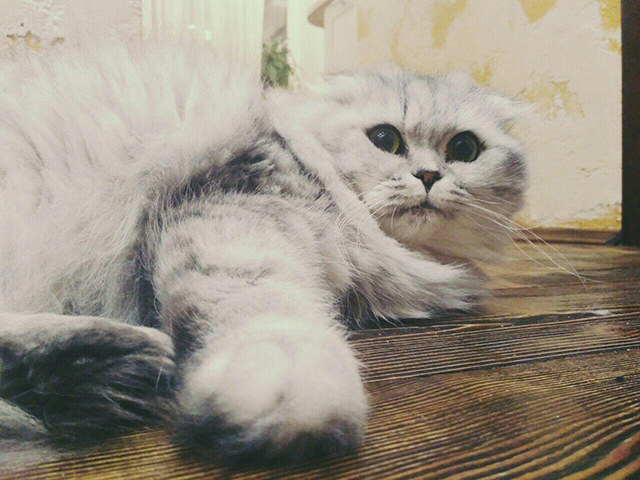

----------

Here you can see [How does the Internet work](https://www.youtube.com/watch?v=qEdv_pem-JM) or play some funny [game](http://spielzeugz.de/html5/liquid-particles/)


What's up?


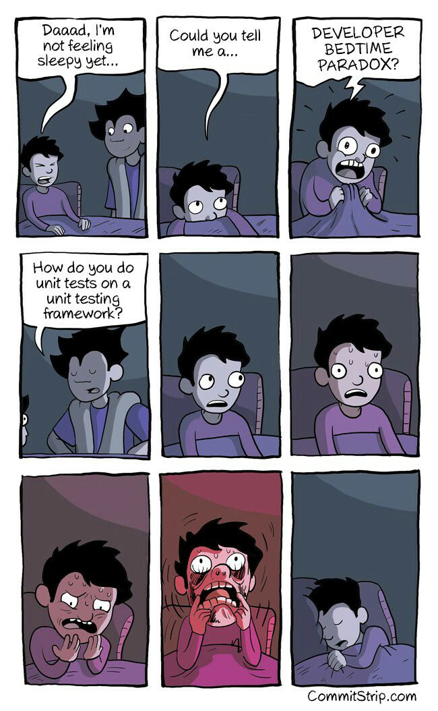 some text added

Hi!

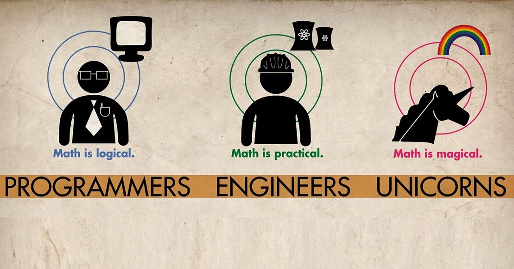

Hi)

Kottans unite! We must seize the world of frontend)


Hello)
Resolve conflict

Hey. How do you like this cat?

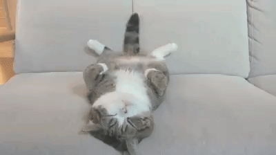

Hi there!

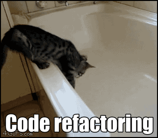

Hello everybody!)

Hi guys =)

<b>Hello all.</b>

Hello, World and Kottans!
- [x] Hello!

__Hi there.__ Hm, didn't know about *markdown* in README.md

Hello everyone!

How do you do, fellow kottans?

(Did I screw up the ascii logo already?)

      /\_/\
    =(/\./\)=
     (")_(")

----------

Hi everybody! I'm Anna. Pleased to meet all of you!

Here is my checklist for now:

- [x] Task_0

Here is your checklist for today:

- [x] Merge Anna's pull request with changes for the README.md file

:sweat_smile:
----------
Hello, guys! ˆˆ

-----------------------------
┏(-_-)┛┗(-_- )┓┗(-_-)┛┏(-_-)┓
_________________________________
Hi everybody!
My second try
:-)
-------------------------------------------------
Hi there. Really happy to be a part of this.

-------------------------------------------------

----------
*Hi there! I'm glad to visit this page.*

*Good luck to all.*

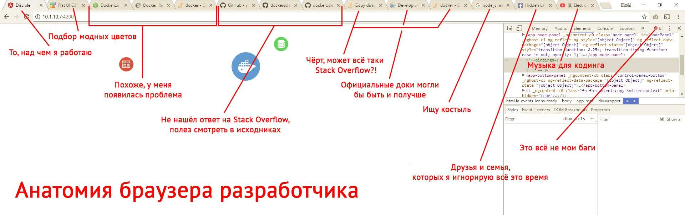
----------
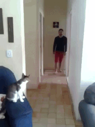
-------------------------------------------------
HI!! =^..^=

Puss in the boots :)

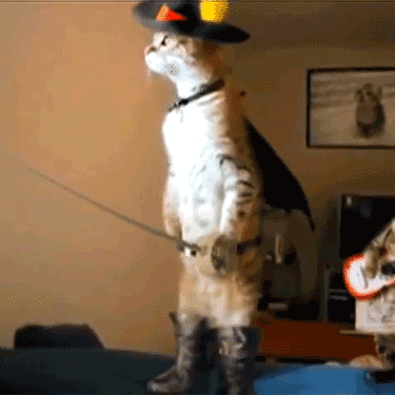

HOW ARE YOU GENTLEMEN !!

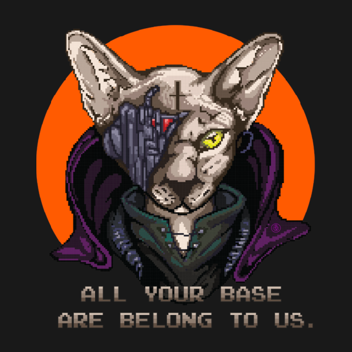

This cat is ready for start, so be like him.


HELLO FRONT-END WORLD!!!
HELLO KOTTANS!!!

Meow! I'm with you, cats

-------------------------------------------------
Hi. This just for completing task 0, so never mind.
-------------------------------------------------
Hello everybody! I'm glad to join the learning!
------------------------------------------
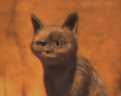


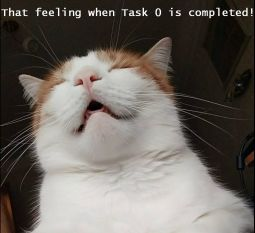

 HELLO KOTTANS!!
 Its my pull-request
 We need more dogs
 

It's a fiasco, bro!

HI THERE)) Good luck to all and let's have some fun!

Hi everyone!

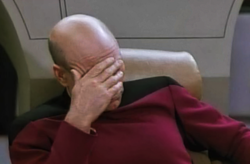

One more cat here.

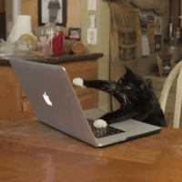
hi there !

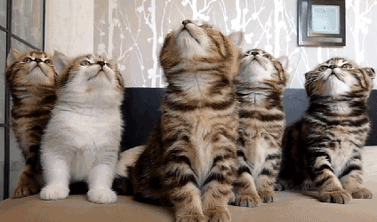

**Hello fellas and girls**

<hr>
<h3>Hi guys! I'm Olga!</h3>

This is my first pull-request. Good luck to all of you! Hope I will  catch you up with all these tasks. This is me when I read Kottans/frontend chat at gitter


<hr>
Hello everyone, I'm Helen.

Hello everyone. My lazy commit for being part of this great community.

<hr>

**Hi all! Too many cats in one readme!))) let add one more!)**


<hr>

Hi guys!
Be careful it's the karate-cat!
 

 <hr>

 Hi, there's double:)

 

<hr>

Hey, people! Let's dance =)
 

 <hr>
 Hi :alien:s! You are awesome! Here one more

 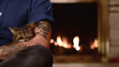

 Hello to fellow kottans. Ready to depart!

 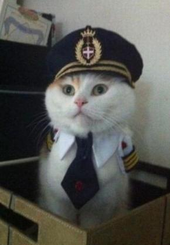

 <hr>

 Hi everyone :wave: !
 :smiley_cat: Tried to find the best cat's gif but just spend few hours on 9gag :sweat_smile:

 <hr>

 **Hello everybody!)** :smiley_cat:
 I'm glad to be part of such a great community! :smiley:

 <hr>

Heya kottans!
Let's make this world better

 Hi! It's nice to meet you!
 __________________________________________
 Hi everybody from the Down Under! (^_-)Y

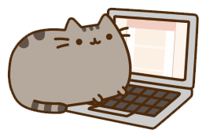


 <hr>

 **** Hi! ****
 I'm Ira. It's very cool to be here! You're awesome!
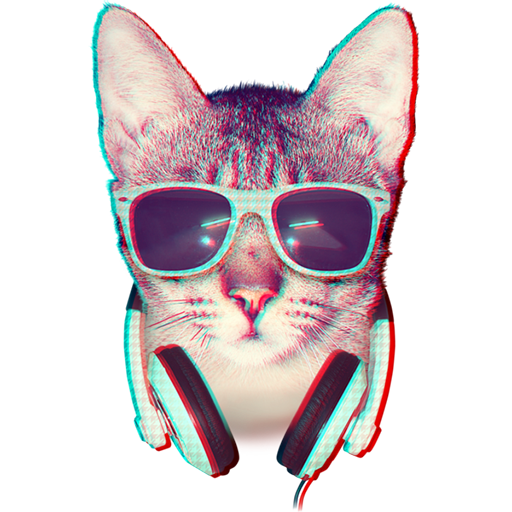

 <hr>

Hi everybody!

 <hr>

Merge pls)
Hi everybody! Glad to see you all)
=======
<hr>

 **** Hi everyone! ****
=======

 <hr>

Hi, Kottans!

*********
Hello people

> Hello cats! 🔥
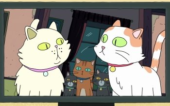


<hr>

Hi Kottans! Let's be friends :)
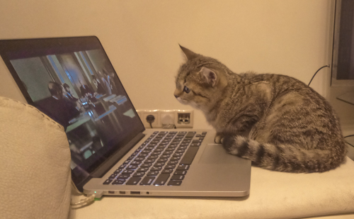

<hr>

I'm interesting, can i send pull request from master branch to another
master branch?

---
## Hi everybody!
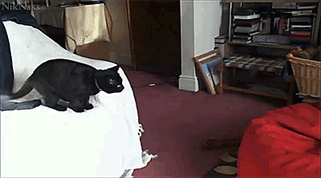
---
Hello everyone! What's up?!

---

Hello!
Ladies... Gentlemen...


---

Hello everyone!


---

Thx Kottans! My first PR =)
Hi there!
First pull-request!
---

## ~~Hello, world~~ **Hello, Kottans** :cat:


----
#### Hey there! I’m Kostya :smiley:
##### I like IT-Universe and started to learn HTML/CSS and JS.
##### Want to be a part of your cool team! :smiley_cat: :smiley_cat: :smiley_cat:
#### Good luck for all!
----
```
 Hello there I'm wanna be a part of KottansCommunity.
 My name is Alexey I begin learning deeper in FE and u can contact me via telegram @alexeysalfetkin
```

----
#### Hello everyone! ^^

---
## Howdy ya'll! Hopefully, me and Neko here can become true Kottans! Cheers!

---

----------

#### Hello everyone! I'm Andrew. Nice to meet you all! :cat:

----------
Hello everyone!
Never too late)


Hello everyone. My name is Yaroslav Cherenyk!
------------
### Hey!
### It seems it is a good chance to make my mark on this file.
### So the mission is completed.
### Good luck for everyone!
------------


Hello kottans! Good luck!
------------------------

Hi guys! I'm Daria.
Now you read the text that I thought up 15 minutes)

-------------------------

Hello every one! I'm Mary, nice to meet you, Kottans! I have a pug, is it okay?

------------------------
Hello everybody! I am Sergey. Eager to join the communty :)

---

Grats to Kottans community! =^.^=
<br>


------------------------
##### Hello Kottans!
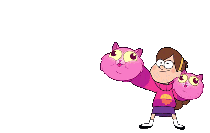
------------------------
#### Hey!  What's up !?
I'm Sasha from Kiev.
You have done a great work to create this course !
I think it will be fun, and this is a good chance to improve skills ! :smile:
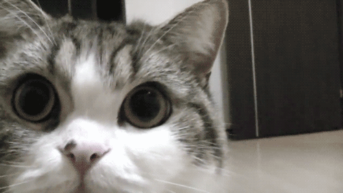


### Hi, Kottans! :+1

My name is Victoria!
Good luck everyone and me. I hope this course give all of us new opportunity and lots of new friends! and of course a lot of sleepless nights )))) **Good Luck!!!**

### Hi, I'm waiting for the interesting Frontend trip!!###

------------------------------
Hi, everybody!
Happy to be here!
The interesting journey begins!
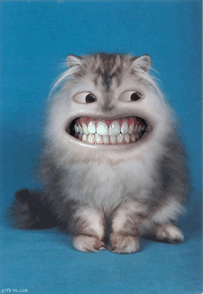
-------------------------------
# Hi. everybody!
I'm Yuriy.
# Here is  markdown  [wiki](https://ru.wikipedia.org/wiki/Markdown)
and link to my [git](https://github.com/yuraer/)
